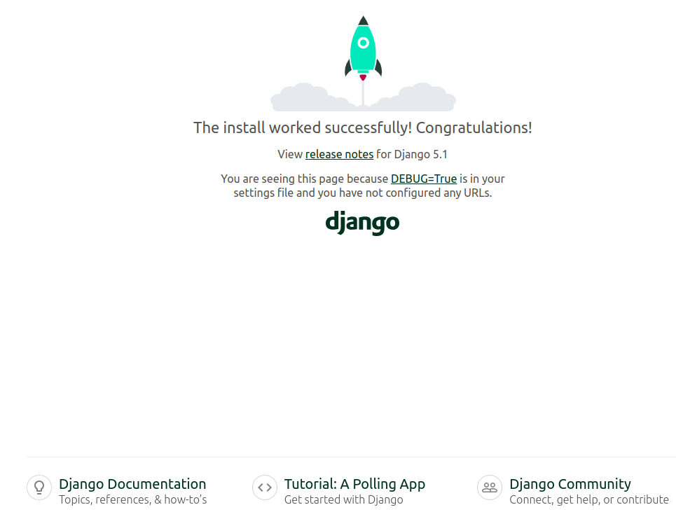

# Aula Django 01 - Visão Geral do Django

<p align="center">
  <a href="#">
    
  </a>
  <a href="#">
    
  </a>
  <a href="#">
    
  </a>
</p>

## Índice

* [Introdução](#introdução)
* [Recursos Utilizados](#recursos-utilizados)
* [Fundamentos Teóricos](#fundamentos-teóricos)
* [Objetivo da Aula](#objetivo-da-aula)
* [Desenvolvimento do Projeto](#desenvolvimento-do-projeto)
* [Créditos e Referências](#créditos-e-referências)

## Introdução

<a href="#índice"></a>

O objetivo deste tutorial é apresentar uma visão geral do framework Python Django em que as principais funcionalidades do Django são apresentadas. Esse projeto será utilizado na disciplina GAC116 - Programação Web da Universidade Federal de Lavras (UFLA).

Este tutorial foi elaborado com base no tutorial disponível no [curso de Django da W3Schools](https://www.w3schools.com/django/index.php) e na [documentação oficial do Django](https://docs.djangoproject.com/pt-br/5.0/).

A aula está organizada no formato de tutorial, permitindo que cada estudante replique em seu computador os conceitos e recursos apresentados. O código será desenvolvido gradualmente, de modo a evidenciar a evolução da solução e facilitar a compreensão de como as tecnologias Django, HTML e SQL se integram na construção de aplicações web.

## Recursos Utilizados

<a href="#índice"></a>

A seguir estão listados os principais recursos empregados no desenvolvimento desta aula.

### Linguagens

* Python - Linguagem de programação principal
  * [Link do site Python](https://www.python.org/)
  * [Link do curso da W3Schools](https://www.w3schools.com/python/default.asp)
* HTML - Responsável pela estrutura da página web
  * [Link do curso da W3Schools](https://www.w3schools.com/html/default.asp)
* SQL - Linguagem para consultas no banco de dados
  * [Link do curso da W3Schools](https://www.w3schools.com/sql/default.asp)

### Frameworks

* Django - Framework web
  * [Link do site do Django](https://www.djangoproject.com/)
  * [Link do curso da w3schools](https://www.w3schools.com/django/index.php)

### Ferramentas

* Visual Studio Code - Ambiente de desenvolvimento integrado - [link](https://code.visualstudio.com/)
* Git - Sistema de controle de versão - [link](https://git-scm.com/)
* Github - Plataforma de hospedagem e colaboração em projetos de software - [link](https://github.com/)
* Pip - Gerenciador de pacotes do Python - [link](https://pypi.org/project/pip/)
* Venv - Ambiente virtual do Python - [link](https://docs.python.org/pt-br/3/library/venv.html)
* SQLite Online - SGBD - [link](https://sqliteonline.com/)
* DB Browser for SQLite - SGBD - [link](https://sqlitebrowser.org/)

## Fundamentos Teóricos

<a href="#índice"></a>

A seguir estão destacados alguns dos principais fundamentos teóricos para entendimento deste tutorial.

### Características do Django

**1. Framework completo:** Django oferece tudo o que é necessário para o desenvolvimento de uma aplicação web, incluindo roteamento de URLs, Mapeamento Objeto-Relacional (ORM), sistema de templates, autenticação, etc.

**2. Administração automática:** Com base nos modelos definidos, Django gera automaticamente uma interface administrativa poderosa e personalizável, economizando tempo no desenvolvimento de funcionalidades administrativas.

**3. ORM (*Object-Relational Mapping*):** O Django possui um ORM que facilita a interação com bancos de dados relacionais, permitindo que os desenvolvedores escrevam consultas em Python ao invés de SQL.

**4. Sistema de templates:** Django possui um sistema de templates eficiente que permite criar HTML dinâmico de forma organizada, utilizando lógica básica como laços e condicionais.

**5. Segurança embutida:** O Django se preocupa com a segurança, oferecendo proteção contra ataques comuns como SQL *Injection*, *Cross-site Scripting* (XSS), *Cross-site Request Forgery* (CSRF), e *Clickjacking*.

**6. Escalabilidade:** Django é altamente escalável, podendo lidar com grandes volumes de tráfego, como em sites populares que utilizam o framework (por exemplo, Instagram e Pinterest).

**7. Comunidade ativa e documentação:** Django conta com uma ampla comunidade de desenvolvedores e uma documentação completa e detalhada, facilitando a resolução de problemas e o aprendizado.

**8. Reutilização de código:** Django promove a reutilização de componentes por meio de pacotes chamados "apps". Cada app é modular e pode ser usado em diferentes projetos ou em diferentes partes da mesma aplicação.

**9. Suporte a várias bases de dados:** O Django suporta diferentes sistemas de banco de dados, como PostgreSQL, MySQL, SQLite e Oracle, tornando-o flexível para diversos ambientes.

**10. Testes integrados:** O Django tem suporte nativo para testes automatizados, permitindo que desenvolvedores escrevam e executem testes facilmente para garantir a qualidade do código.

### Arquitetura Web de Três Camadas

A arquitetura web de três camadas é um padrão de design de software que organiza uma aplicação em três níveis distintos, cada um com responsabilidades bem definidas. Essas camadas são:

**1. Camada de Apresentação (Frontend)**:

* Também chamada de interface de usuário, essa camada é responsável pela interação com o usuário. Ela inclui tudo o que o usuário vê e utiliza para interagir com o sistema, como páginas web, formulários, botões, e elementos visuais em geral.
* Aqui, são usados tecnologias como HTML, CSS, JavaScript e frameworks frontend (React, Angular, etc.).
* A camada de apresentação envia as entradas dos usuários para a camada de negócios e exibe os resultados de volta para o usuário.

**2. Camada de Negócios (Lógica da Aplicação - Backend)**:

* Nessa camada está a lógica de negócios da aplicação, ou seja, as regras que governam como os dados devem ser processados e as operações que devem ser realizadas. Ela trata os pedidos recebidos da camada de apresentação e executa as operações necessárias.
* Essa camada pode incluir validações, cálculos e chamadas ao banco de dados. Em termos de tecnologia, é geralmente desenvolvida com linguagens de programação como Python, Java, PHP, ou frameworks como Django, Spring Boot, Laravel, etc.

**3. Camada de Dados (Banco de Dados - Backend)**:

* A camada de dados gerencia o armazenamento e recuperação de dados em um banco de dados. Ela é responsável pela persistência dos dados e operações como criar, ler, atualizar e deletar (CRUD).
* Geralmente, são usados sistemas de gerenciamento de banco de dados relacionais (como MySQL, PostgreSQL) ou não relacionais (como MongoDB).
* A camada de negócios interage com essa camada para armazenar e buscar dados conforme necessário.

**Fluxo da Arquitetura de Três Camadas**:

* O usuário interage com a Camada de Apresentação.
* A Camada de Apresentação faz requisições para a Camada de Negócios.
* A Camada de Negócios processa a lógica e, se necessário, interage com a Camada de Dados.
* A Camada de Dados responde com os dados necessários para a Camada de Negócios.
* A Camada de Negócios retorna os resultados processados para a Camada de Apresentação.
* A Camada de Apresentação exibe os resultados para o usuário.

Essa separação facilita a manutenção e escalabilidade da aplicação, permitindo que cada camada possa ser modificada ou melhorada de forma independente.


### Arquitetura MVT do Django

O modelo MVT (*Model-View-Template*) é uma arquitetura usada no framework Django para desenvolvimento de aplicações web. Ele organiza a aplicação em três componentes principais:

* **Model (Modelo)**: Responsável pela definição da estrutura dos dados e a interação com o banco de dados. Ele define as classes que representam as tabelas e seus relacionamentos, além de métodos para realizar consultas e operações nos dados.

* **View (Visão)**: Contém a lógica da aplicação. A view recebe as requisições dos usuários, processa os dados (geralmente acessando o Model), e retorna uma resposta, como uma página HTML renderizada ou dados em formato JSON.

* **Template (Apresentação)**: É a camada de apresentação, onde o conteúdo dinâmico gerado pela View é inserido em arquivos HTML. Os templates permitem a separação da lógica de negócio da interface de usuário, tornando o código mais organizado.

Diferente do padrão MVC, onde o controller gerencia a lógica de controle, no Django, a função das views cumpre esse papel, enquanto os templates gerenciam a apresentação.

A figura abaixo detalha os componentes descritos acima.


No modelo MVT do Django, as requisições seguem um fluxo bem definido, onde cada componente (Model, View, Template) desempenha um papel específico no processamento e resposta de uma requisição HTTP. O fluxo funciona da seguinte forma:

* **Recebimento da Requisição (HTTP Request)**: Quando um usuário acessa uma URL no navegador, o Django recebe a requisição HTTP correspondente. Esse processo começa no URL *dispatcher* (mapeador de URLs), que verifica qual view deve ser chamada com base na URL requisitada.

* **View (Visão)**: A View é o ponto de entrada para o processamento da requisição. A função ou classe associada à URL recebida é executada. Ela é responsável por: Receber a requisição do usuário; Executar a lógica necessária, que pode incluir validações, processamento de dados, ou interações com o banco de dados através dos Models; e Retornar uma resposta apropriada.

* **Model (Modelo)**: Se a View precisar acessar ou manipular dados, ela fará isso por meio do Model. O Model contém a lógica de negócios relacionada à persistência de dados, permitindo a View realizar operações como criar, ler, atualizar ou deletar registros no banco de dados.

* **Template (Apresentação)**: Após processar os dados, a View geralmente prepara um contexto (um dicionário de dados) e passa esse contexto para o Template. O Template é um arquivo HTML com marcações especiais do Django que permitem a inserção de dados dinâmicos. O Template renderiza esses dados em uma estrutura HTML, exibindo o conteúdo adequado com base nas informações passadas pela View.

* **Resposta (HTTP Response)**: Depois que o Template é renderizado, a View retorna uma resposta HTTP (normalmente uma página HTML ou dados JSON em APIs) ao navegador ou cliente. Essa resposta contém o conteúdo processado e visualizado pelo usuário.

A figura abaixo detalha o fluxo descrito acima.


A figura abaixo detalha ainda mais a arquitetura MVT e as tecnologias envolvidas.


### Modelo ORM

O Django suporta o conceito de Mapeamento Objeto-Relacional (ORM). Através do ORM você define a modelagem de dados através de classes em Python. Com isso é possível gerar suas tabelas no banco de dados e manipulá-las sem necessidade de utilizar SQL (o que também é possível). Os registros de cada tabela são representados como instâncias das classes correspondentes.

## Objetivo da Aula

<a href="#índice"></a>

O objetivo desta aula é apresentar uma introdução ao framework Python Django e como o mesmo se relaciona com a página HTML e o modelo de dados ORM. Aprenderemos a configurar o Django, a criar uma view, um template, um modelo, a acessar o ambiente administrativo e como realizar o cadastro, leitura, atualização e exclusão (CRUD) de dados. O Django é utilizado no desenvolvimento de páginas web do lado do servidor, ou seja, é uma ferramenta backend e funciona segundo a arquitetura MVT.

## Desenvolvimento do Projeto

<a href="#índice"></a>

Siga os passos abaixo para alcançar o objetivo da aula.

### Clonar o Repositório

Para iniciar, faça o clone do repositório com o seguinte comando:

```bash
git clone https://github.com/ufla-prog-web/aula-django-01.git
```

### Baixar o Repositório

Como alternativa ao clone, você pode baixar diretamente o repositório acessando este [link](https://github.com/ufla-prog-web/aula-django-01). Clique em `Code` e, em seguida, em `Download ZIP`.

### Instalar o Python

Se necessário, instale o Python [link](https://www.python.org/downloads/).

Verifique a versão instalada:

```bash
python3 --version
```

### Instalar o Pip

Se necessário, instale o pip:

```bash
sudo apt install python3-pip
```

Verifique a versão instalada:

```bash
python3 -m pip --version
```

### Abrir o Visual Studio Code

Abra o Visual Studio Code (VS Code) na pasta `aula-django-01`.

**Dica:** abra o arquivo `README.md` e selecione a opção `Open Preview to the Side` para visualizar o tutorial lado a lado enquanto desenvolve a aplicação.

**Dica:** abra um terminal utilizando a IDE clicando em `Terminal` e `New Terminal`.

### Navegar até a Pasta do Projeto

No terminal do VS Code, acesse a pasta do projeto `aula-django-01`:

```bash
cd aula-django-01
```

### Criar o Ambiente Virtual

Crie um ambiente virtual para isolar as dependências do projeto:

```bash
python3 -m venv venv
```

**Observação:** no exemplo acima, o segundo nome `venv` é o nome que escolhemos para o nosso ambiente virtual (isso pode ser alterado).

### Ativar o Ambiente Virtual

Ative o ambiente virtual no seu computador utilizando o comando:

```bash
source venv/bin/activate
```

Para sair do ambiente virtual:

```bash
deactivate
```

### Instalar o Django

Instale o Django dentro do ambiente virtual criado (testado na versão 5.0):

```bash
python3 -m pip install django
```

Verifique a versão instalada:

```bash
django-admin --version
```

ou

```bash
python3 -m django --version
```

**Observação:** caso o terminal não encontre o django-admin, execute o seguinte comando (utilizado geralmente quando não se utiliza o venv no laboratório DCC07):

```bash
export PATH=$PATH:~/.local/bin
```

### Criar o Projeto no Django

Crie uma pasta chamada `code` dentro do projeto `aula-django-01`:

Crie um projeto em Django utilizando o comando abaixo:

```bash
cd code
django-admin startproject mysite .
```

**Observação:** o ponto no comando acima informa ao Django para não criar uma pasta com nome `mysite` dentro de uma outra pasta `mysite`. Isso evita ter que ficar navegando entre pastas.

### Executar o Projeto

Inicie a execução do projeto Django:

```bash
python3 manage.py runserver
```

**Explicação:** o comando acima é usado no Django para iniciar um servidor de desenvolvimento local. Ele é uma parte fundamental do processo de desenvolvimento web com o Django, pois permite que você execute e teste sua aplicação web em um ambiente de desenvolvimento local antes de implantá-la em um servidor web de produção. Ele inicia um servidor HTTP embutido no Django que pode lidar com solicitações HTTP. Por padrão, o servidor de desenvolvimento escuta na porta 8000, mas você pode especificar uma porta diferente como argumento opcional, por exemplo, `python3 manage.py runserver 8081`.

Acesse no navegador a página [http://127.0.0.1:8000/](http://127.0.0.1:8000/). A página padrão do Django deverá ser exibida (semelhante a imagem abaixo).



### Criar um Aplicativo

Crie um aplicativo (app) chamado `myapp` dentro do projeto:

```bash
django-admin startapp myapp
```

O comando abaixo faz a mesma coisa:

```bash
python3 manage.py startapp myapp
```

**Explicação:** o comando acima é usado para criar uma nova aplicação dentro de um projeto Django. Após executar esse comando, você terá uma nova pasta chamada `myapp` dentro do seu projeto Django, contendo uma estrutura inicial de arquivos Python que você pode começar a editar para construir a lógica da sua aplicação. Uma aplicação (ou app) é um componente reutilizável e modular que realiza uma função específica dentro de um projeto Django. Um projeto Django pode conter várias aplicações, cada uma projetada para lidar com uma parte específica da funcionalidade do site. Cada aplicação é composta por:

* **Models:** Definem a estrutura e o comportamento dos dados. Os modelos são utilizados para interagir com o banco de dados e representar os objetos do mundo real dentro do sistema.

* **Views:** Responsáveis por processar as requisições do usuário e retornar as respostas adequadas. As views são geralmente funções que recebem uma solicitação HTTP e retornam uma resposta HTTP, como uma página da web renderizada ou um objeto JSON.

* **Templates:** Arquivos de templates que definem a aparência das páginas da web. Os templates são usados pelas views para renderizar o conteúdo dinâmico que será enviado ao navegador do usuário.

* **Arquivos Estáticos (opcional):** Como CSS, JavaScript e imagens, que são usados para estilizar e adicionar interatividade às páginas da web.

* **URLs:** Mapeiam as URLs do site para as views correspondentes. Cada aplicação geralmente tem seu próprio arquivo urls.py para definir os padrões de URL específicos dessa aplicação.

### Conhecer a Estrutura de Diretórios do Django

A estrutura de diretórios de um projeto Django é organizada de maneira a separar os diferentes componentes da aplicação, facilitando o desenvolvimento e a manutenção. A seguir, temos a estrutura geral de diretórios de um projeto feito em Django.

```text
mysite/
│
├── manage.py
├── mysite/
│   ├── __init__.py
│   ├── asgi.py
│   ├── settings.py
│   ├── urls.py
│   └── wsgi.py
├── myapp1/
│   ├── migrations/
│   ├── templates/
│   ├── __init__.py
│   ├── admin.py
│   ├── apps.py
│   ├── models.py
│   ├── views.py
│   ├── urls.py
│   └── tests.py
├── myapp2/
│   ├── migrations/
│   ├── templates/
│   ├── __init__.py
│   ├── admin.py
│   ├── apps.py
│   ├── models.py
│   ├── views.py
│   ├── urls.py
│   └── tests.py
└── static/
```

* **manage.py**: Um script que permite interagir com o projeto Django a partir da linha de comando. Ele é usado para executar comandos como iniciar o servidor, migrar o banco de dados e criar superusuários.
* **mysite/**: Esta pasta contém os arquivos de configuração e o núcleo do projeto Django. Normalmente, o nome da pasta do projeto coincide com o nome do projeto. Aqui estão os arquivos comuns:
  * **__init__.py**: Indica ao Python que essa pasta deve ser tratada como um pacote.
  * **asgi.py**: Ponto de entrada para servidores ASGI (usado para rodar a aplicação em modo assíncrono).
  * **settings.py**: Arquivo de configuração onde você define parâmetros como a conexão com o banco de dados, apps instalados, middleware, etc.
  * **urls.py**: Arquivo que define os mapeamentos de URL do projeto para as views.
  * **wsgi.py**: Ponto de entrada para servidores WSGI (usado para rodar a aplicação em modo síncrono).
* **myapp/**: O Django incentiva o uso de uma abordagem modular, onde a funcionalidade de uma aplicação é dividida em "apps" individuais. Cada app tem sua própria pasta dentro do projeto e contém a lógica de uma parte específica do sistema.
  * **migrations/**: Contém arquivos de migração que Django usa para gerenciar o banco de dados. Cada migração reflete uma mudança no modelo de dados.
  * **templates/**: Essa pasta contém os arquivos HTML que serão renderizados pelas views. Cada app pode ter sua própria pasta `templates/` ou você pode criar uma pasta `templates/` global na raiz do projeto.
  * **__init__.py**: Marca a pasta como um pacote Python.
  * **admin.py**: Define como os modelos do app serão exibidos na interface administrativa do Django.
  * **apps.py**: Define a configuração do app.
  * **models.py**: Contém a definição dos modelos (classes) que representam as tabelas do banco de dados.
  * **views.py**: Contém as funções ou classes que processam as requisições e retornam as respostas.
  * **urls.py**: Define as rotas específicas para as views deste app.
  * **tests.py**: Contém testes automatizados para a aplicação.
* **static/**: Essa pasta contém arquivos estáticos, como CSS, JavaScript e imagens. Os arquivos dentro de `static/` são usados para a apresentação visual da aplicação.

### Criar a Primeira View

Edite o arquivo de `myapp/views.py` e coloque o conteúdo:

```python
from django.shortcuts import render
from django.http import HttpResponse

def teste(request):
    return HttpResponse("Olá Mundo!")
```

Crie um arquivo `urls.py` na pasta `myapp` com o conteúdo:

```python
from django.urls import path
from . import views

urlpatterns = [
    path('teste/', views.teste, name='teste'),
]
```

Essa configuração registra a rota `/teste/` que chama `views.teste`. Assim, quando o usuário acessar a rota ou URL [http://127.0.0.1:8000/teste/](http://127.0.0.1:8000/teste/), o método `views.teste` será executado.

Abra o arquivo chamado `urls.py` da pasta `mysite` e inclua as rotas do app, como abaixo:

```python
from django.contrib import admin
from django.urls import path, include

urlpatterns = [
    path('', include('myapp.urls')),
    path('admin/', admin.site.urls),
]
```

Inicie o servidor de desenvolvimento:

```bash
python3 manage.py runserver
```

* Acesse [http://127.0.0.1:8000](http://127.0.0.1:8000). A página exibirá **Page not found (404)**, pois não há rota para `/`.
* Acesse [http://127.0.0.1:8000/teste/](http://127.0.0.1:8000/teste/). A mensagem **"Olá, mundo!"** deverá ser exibida.
* Para encerrar o servidor: Ctrl+C.

### Atividade 1 - Crie uma Nova View e Nova Rota

Utilizando o exemplo anterior como base, crie uma nova view e uma nova rota para a sua aplicação. Em seguida, faça testes para verificar se tudo funcionou corretamente.

### Criar o Primeiro Template

Crie uma pasta `templates` dentro da pasta `myapp` e crie um arquivo HTML chamado `paginateste.html`.

Abra o arquivo `myapp/templates/myapp/paginateste.html` e insira o conteúdo:

```html
<!DOCTYPE html>
<html>
  <head>
    <meta charset="utf-8">
    <title>Aplicação Django</title>
  </head>
  <body>
    <h1>Olá Mundo!</h1>
    <p>Bem-vindo ao meu primeiro projeto Django!</p>
  </body>
</html>
```

Agora, é necessário modificar a visualização. Abra o arquivo `views.py` e substitua o método de visualização `teste` por este:

```python
from django.http import HttpResponse
from django.template import loader

def teste(request):
    template = loader.get_template('paginateste.html')
    return HttpResponse(template.render())

...

```

Para poder trabalhar com coisas mais complicadas do que **"Olá Mundo!"**, temos que dizer ao Django que um novo aplicativo foi criado. Isso é feito no arquivo `mysite/settings.py`. Procure a lista `INSTALLED_APPS[]` e adicione o aplicativo `myapp` que foi criado. Veja o exemplo abaixo:

```python
INSTALLED_APPS = [
    'django.contrib.admin',
    'django.contrib.auth',
    'django.contrib.contenttypes',
    'django.contrib.sessions',
    'django.contrib.messages',
    'django.contrib.staticfiles',
    'myapp',                      # registre o app criado aqui
]
```

Em seguida, execute o comando abaixo para aplicar migrações:

```bash
python3 manage.py migrate
```

**Observação:** este comando atualiza o esquema do banco de dados conforme os apps instalados.

Inicie o servidor de desenvolvimento:

```bash
python3 manage.py runserver
```

Acesse: [http://127.0.0.1:8000/teste/](http://127.0.0.1:8000/teste/`). A página criada deverá ser exibida.

### Atividade 2 - Crie uma Nova Página

Utilizando o exemplo anterior como base, crie uma nova página HTML e atualize a view na sua aplicação que você mesmo havia criado na Atividade 1 feita anteriormente. Em seguida, faça testes para verificar se tudo funcionou corretamente.

### Passar Parâmetros para o Template

Agora, iremos passar parâmetros do Python para o template HTML utilizando tags do Django. Por padrão, o Django utiliza a *Django Template Language* (DTL) que é uma forma de templates similar a biblioteca [Jinja](https://jinja.palletsprojects.com/en/3.1.x/). Com essa linguagem de templates é possível executar lógica de programação, como executar instruções condicional (**if** ) e repetição (**for**).

Crie o arquivo `myapp/templates/testeparametros.html` com o conteúdo:

```html
<!DOCTYPE html>
<html>
  <head>
    <meta charset="utf-8">
    <title>Aplicação Django</title>
  </head>
  <body>
    <h1>Tags de Templates do Django</h1>
    <p>Exemplo com tags para variáveis:</p>
    <ul>
        <li><b>Nome:</b> {{ nome }} </li>
        <li><b>Idade:</b> {{ idade }} </li>
        <li><b>E-mail:</b> {{ email }} </li>
        <li><b>Telefone:</b> {{ telefone }} </li>
        <li><b>Usuário Ativo:</b> {{ usuarioativo }} </li>
    </ul>
    <p>Exemplo com tags para condicional:</p>
    
        <b>Programação</b>
    
        <b>Web</b>
    
        <b>UFLA</b>
    
    <p>Exemplo com tags para repetição:</p>
    <ul>
        
            <li>{{ x }}</li>
        
    </ul>
  </body>
</html>
```

O template Django pode renderizar variáveis ​​colocando-as entre chaves `{{ }}`. Para executar comandos como **if** e **for** precisamos colocá-los entre chaves ``. A sintaxe para isso é semelhante a da linguagem Python.

Edite o arquivo `myapp/views.py` e adicione o conteúdo ao final:

```python
...

def testeparametros(request):
    context = {
        "nome": "José Silva",
        "idade": 30,
        "email": "jose.silva@email.com",
        "telefone": "3333-1234",
        "usuarioativo": True,
        "condicional": 3,
        'numeros': [2, 3, 5, 7, 11, 13, 17, 19, 23, 29]
    }
    template = loader.get_template('testeparametros.html')
    return HttpResponse(template.render(context, request))
```

O código acima criou um dicionário chamado `context` em que diversas chaves e valores foram definidas. Esses dados foram passados para o código HTML através da função `template.render()`. Em seguida, o template (HTML) pega os dados para exibi-los. Nesse exemplo, os dados vieram de um dicionário do Python, no futuro poderão vir de um Banco de Dados.

Edite o arquivo `myapp/urls.py` e adicione a linha abaixo:

```python
...

urlpatterns = [
    ...
    path('testeparametros/', views.testeparametros, name='testeparametros') # linha adicionada
]
```

Acesse: [http://127.0.0.1:8000/testeparametros/](http://127.0.0.1:8000/testeparametros/`) e verifique a renderização dos valores.

### Atividade 3 - Passar Novos Parâmetros

Altere o método `testeparametros` no arquivo `views.py` para passar dois novos parâmetros para o template. Dessa maneira, é necessário alterar também o arquivo `testeparametros.html` para receber os dados passados e imprimi-los na tela. Em seguida, faça testes para verificar se tudo funcionou corretamente.

### Criar o Primeiro Modelo

Até esse momento, construímos a aplicação web com interface, com URLs e algum processamento, mas não trabalhamos com Banco de Dados (BD). Os dados estavam inseridos diretamente ("fixos") no código.

A partir de agora, os dados serão persistidos em BD por meio de modelos (tabelas). Uma tabela chamada Livro será criada no BD SQLite disponível no Django. No Django, uma tabela é criada através da implementação de uma classe (ORM).

Assim, vamos criar uma classe chamada `Livro`. Para isso, edite o arquivo `myapp/models.py` e digite o conteúdo:

```python
from django.db import models

class Livro(models.Model):
    nome = models.CharField(max_length=255)
    autor = models.CharField(max_length=255)
    ano = models.IntegerField()
```

O código acima irá criar uma Tabela chamada Livro no BD SQLite. Os campos `nome` e `autor` são campos de texto e estão configurados para ter no máximo 255 caracteres. O campo `ano` é um campo numérico inteiro.

**Observação:** quando criamos o projeto Django, obtivemos um banco de dados SQLite vazio. Ele estava na raiz da pasta `aula-django-01/code/` e possui o nome de arquivo `db.sqlite3`. Por padrão, todos os modelos criados no projeto Django serão criados como tabelas neste banco de dados.

Execute o comando abaixo para que seja criado a tabela Livro no banco de dados de fato:

```bash
python3 manage.py makemigrations myapp
```

O que resultará na saída:

```bash
Migrations for 'myapp':
  myapp/migrations/0001_initial.py
    - Create model Livro
```

O Django cria um arquivo descrevendo as alterações e armazena o arquivo na pasta `/myapp/migrations/` com nome `0001_initial.py`. Abra esse arquivo para analisar o conteúdo. Observe que o Django insere um campo `id` para suas tabelas, que é um número auto incrementado.

A tabela ainda não foi criada, você terá que executar mais um comando, então o Django criará e executará uma instrução SQL, baseada no conteúdo do novo arquivo da pasta `/myapp/migrations/`.

Execute o comando de migração:

```bash
python3 manage.py migrate
```

O que resultará na saída:

```bash
Operations to perform:
  Apply all migrations: admin, auth, contenttypes, myapp, sessions
Running migrations:
  Applying myapp.0001_initial... OK
```

Você pode visualizar as instruções SQL que foram executadas na migração acima. Basta executar este comando, com o número da migração:

```bash
python3 manage.py sqlmigrate myapp 0001
```

O que resultará nesta saída:

```sql
BEGIN;
--
-- Create model Livro
--
CREATE TABLE "myapp_livro" ("id" integer NOT NULL PRIMARY KEY AUTOINCREMENT, "nome" varchar(255) NOT NULL, "autor" varchar(255) NOT NULL, "ano" integer NOT NULL);
COMMIT;
```

### Acessar o Ambiente Administrativo

O Django Admin é uma ferramenta ótima do Django, na verdade é uma interface de usuário CRUD (Criar, Ler, Atualizar, Excluir) para todos os seus modelos!

Para entrar na interface do usuário administrativo, inicie o servidor:

```bash
python3 manage.py runserver
```

Acesse: [127.0.0.1:8000/admin/](127.0.0.1:8000/admin/)

A razão pela qual esta URL vai para a página de login do administrador do Django pode ser encontrada no arquivo `mysite/urls.py`:

```python
from django.contrib import admin
from django.urls import include, path

urlpatterns = [
    path('', include('myapp.urls')),
    path('admin/', admin.site.urls),
]
```

A lista `urlpatterns[]` recebe solicitações na rota `admin/` e as envia para `admin.site.urls`, que faz parte de um aplicativo integrado que vem com o Django e contém muitas funcionalidades e interfaces de usuário, sendo uma delas a interface de usuário de login.

### Criar um Superusuário

Para poder fazer login no ambiente administrativo do Django, precisamos criar um usuário. Isso é feito com o comando:

```bash
python3 manage.py createsuperuser
```

O que dará um prompt como esse:

```bash
Username: admin
Email address: 
Password: 
Password (again): 
The password is too similar to the username.
This password is too short. It must contain at least 8 characters.
This password is too common.
Bypass password validation and create user anyway? [y/N]: y
```

**Observação:** você deve inserir: nome de usuário, e-mail (opcional) e senha. Para testes, sugiro colocar: usuário `admin`, email em branco e senha `admin`. Caso a senha não atenda aos critérios, o Django oferece a opção de prosseguir mesmo assim digitando `y` gerando assim a saída:

```bash
Superuser created successfully.
```

Reinicie o servidor:

```bash
python3 manage.py runserver
```

Acesse: [127.0.0.1:8000/admin/](127.0.0.1:8000/admin/). Preencha o formulário com o nome de usuário e senha.

Na tela aberta você pode Criar, Ler, Atualizar e Excluir grupos e usuários, mas onde está o modelo de Livro?

O modelo Livro está faltando, como deveria estar. Você tem que informar ao Django quais modelos devem estar visíveis na interface administrativa.

### Incluir o Modelo Livro na Interface Administrativa

Para incluir o modelo Livro na interface administrativa, temos que dizer ao Django que este modelo deve estar visível na interface administrativa. Isso é feito em um arquivo chamado `admin.py` que está localizado na pasta do seu aplicativo.

Abra o arquivo `myapp/admin.py`:

```python
from django.contrib import admin

# Register your models here.
```

Insira as linhas abaixo para tornar o modelo Livro visível na página de administração:

```python
from django.contrib import admin
from .models import Livro

admin.site.register(Livro)
```

Acesse: [127.0.0.1:8000/admin/](127.0.0.1:8000/admin/) e analise o resultado.

### Atividade 4 - Cadastro de Livros

Realize o cadastro de livros no ambiente administrativo. Para isso, vá em Livros e clique em Add Livro. Cadastre três livros quaisquer. Em seguida, realize a exclusão de um livro. Logo após, realize a atualização de alguma informação em algum livro.

### Visualizar o Modelo de Dados

Existem diversas ferramentas que podem ser utilizadas para ver o banco de dados criado `db.sqlite3`. A seguir será apresentado duas ferramentas: [SQLite Online](https://sqliteonline.com/) e [DB Browser for SQLite](https://sqlitebrowser.org/).

O site [SQLite Online](https://sqliteonline.com/) oferece uma forma rápida e prática de visualizar dados sem a necessidade de instalação adicional. Acesse esse site e carregue o BD chamado `db.sqlite3` localizado na raiz do projeto.

Execute o comando abaixo nessa ferramenta para listar os livros que você cadastrou utilizando o ambiente administrativo.

```sql
SELECT * FROM myapp_livro;
```

O software [DB Browser for SQLite](https://sqlitebrowser.org/) oferece uma forma simples e prática de visualizar dados, mas precisa de instalação adicional. Utilize essa ferramenta para abrir o arquivo do BD chamado `db.sqlite3`. Para ver os dados de uma tabela você pode ir na aba `Navegar dados` ou então `Executar SQL` e executar a SQL acima.

**Observação:** repare que o nome físico da tabela segue o padrão `<app>_<modelo>`, por exemplo `myapp_livro`.

### Atividade 5 - Crie um Novo Modelo

Crie um novo modelo (tabela) em sua aplicação e registre-o no Admin. Acesse o ambiente administrativo e inclua dados no modelo criado.

**Observação:** após a criação do novo modelo será necessário executar os comandos abaixo:

```bash
python3 manage.py makemigrations myapp
python3 manage.py migrate
```

### Melhorar Visualização do Modelo

Atualmente, o ambiente administrativo não está exibindo os dados dos modelos de forma adequada para o usuário. Veja isso, em Livros, em que temos "Livro object (1)", "Livro membro (2)" etc. O usuário geralmente não deseja ver os dados dessa forma. Seria melhor exibir "nome", "autor" e "ano".

Para mudar isso para um formato mais fácil de ler, temos duas opções:

* Alterar a função de representação de string `__str__()` do modelo de Livro.
* Definir a propriedade `list_details` do modelo de Livro.

Para alterar utilizando a primeira forma, devemos alterar a função de representação de string `__str__()` do modelo de Livro. Para isso, faça o seguinte no arquivo `myapp/models.py`:

```python
from django.db import models

class Livro(models.Model):
    nome = models.CharField(max_length=255)
    autor = models.CharField(max_length=255)
    ano = models.IntegerField()

    def __str__(self):                       # função adicionada
        return f"{self.nome} - {self.autor} - {self.ano}" 
...
```

Acesse: [127.0.0.1:8000/admin/](127.0.0.1:8000/admin/) na tela de Livros e analise o resultado.

Para alterar utilizando a segunda forma (RECOMENDADA), devemos definir a propriedade `list_display` do arquivo `myapp/admin.py`. Primeiro, crie uma classe `LivroAdmin()` e especifique a tupla `list_display`, conforme abaixo:

```python
from django.contrib import admin
from .models import Livro

class LivroAdmin(admin.ModelAdmin):         # função adicionada
    list_display = ("nome", "autor", "ano")

admin.site.register(Livro, LivroAdmin)      # classe adicionada
...
```

Acesse: [127.0.0.1:8000/admin/](127.0.0.1:8000/admin/) na tela de Livros e analise o resultado.

### Atividade 6 - Ajuste a Visualização para Outros Modelos

Ajuste a visualização das colunas de dados para os outros modelos criados em sua aplicação e registre-o no Admin. Acesse o ambiente administrativo para visualizar os ajustes realizados.

### Melhorar Nomeação de Campos do Modelo

Os nomes das colunas exibidos na interface administrativa estão pouco intuitivos, pois foram capturadas automaticamente pelo Django. O correto é nomear adequadamente cada uma das colunas.

Para isso, edite o arquivo `myapp/models.py` e digite o conteúdo:

```python
from django.db import models

class Livro(models.Model):
    nome = models.CharField("Título", max_length=255) # alteração 
    autor = models.CharField("Autor", max_length=255) # alteração
    ano = models.IntegerField("Ano de publicação")    # alteração
    def __str__(self):
        return f"{self.nome} - {self.autor} - {self.ano}" 
...
```

No código acima foi incluído mais um parâmetro nos campos da tabela. O campo `nome` passou a ser chamado de "Título" ao ser exibido na interface administrativa. Por sua vez, o campo `ano` virou "Ano de publicação".

### Atividade 7 - Ajuste os Nomes de Outros Modelos

Ajuste os nomes dos campos para os outros modelos criados em sua aplicação. Acesse o ambiente administrativo para visualizar os ajustes realizados.

### Adicionar Campos no Modelo Livro

Nesta etapa, iremos adicionar um campo (editora) a uma tabela (Livro) depois que ela for criada. Para isso, abra o arquivo `myapp/models.py` e inclua a linha destacada:

```python
...
class Livro(models.Model):
    nome = models.CharField("Título", max_length=255)
    autor = models.CharField("Autor", max_length=255)
    ano = models.IntegerField("Ano de publicação")
    editora = models.CharField("Editora", max_length=255)   # linha incluída
    ...
```

Esta é uma mudança na estrutura do Modelo e, portanto, temos que fazer uma migração para informar ao Django que ele precisa atualizar o banco de dados:

```bash
python3 manage.py makemigrations myapp
```

O comando acima resultará em um prompt, porque tentamos adicionar campos que não podem ser nulos a uma tabela que já contém registros.

Como você pode ver, o Django pergunta se queremos fornecer aos campos um valor específico ou se queremos parar a migração e corrigi-la no modelo:

```text
It is impossible to add a non-nullable field 'editora' to livro without specifying a default. This is because the database needs something to populate existing rows.
Please select a fix:
 1) Provide a one-off default now (will be set on all existing rows with a null value for this column)
 2) Quit and manually define a default value in models.py.
Select an option: 
```

Selecione a opção 2, abra o arquivo `myapp/models.py` novamente e permita valores `NULL` para o novo campo (editora):

```python
...
class Livro(models.Model):
    nome = models.CharField("Título", max_length=255)
    autor = models.CharField("Autor", max_length=255)
    ano = models.IntegerField("Ano de publicação")
    editora = models.CharField("Editora", max_length=255, null=True)   # linha atualizada
    ...
```

E faça a migração mais uma vez:

```bash
python3 manage.py makemigrations myapp
```

Execute o comando migrate:

```bash
python3 manage.py migrate
```

### Momento para Reflexão

* Por que usar um framework em vez de programar tudo "na mão" em Python?

* Qual camada vocês acham que dá mais trabalho para desenvolver: apresentação, negócios ou dados? Por quê?

* Se um site fosse construído sem separar as camadas, quais problemas poderiam surgir?

* Qual papel vocês acham mais crítico: Model, View ou Template?

* Quais vantagens vocês veem em usar o ORM em vez de escrever SQL direto?

* Que vantagens vocês percebem em já ter uma interface administrativa pronta?

* Vocês acham que o Admin substitui um sistema feito sob medida? Por quê?

* Em um projeto real, que tipo de aplicação vocês acham que poderia ser desenvolvida com Django?

* Se tivessem que convencer uma empresa a adotar Django, quais seriam os principais argumentos?

## Créditos e Referências

<a href="#índice"></a>

Este tutorial foi inspirado nos seguintes materiais:

* [Documentação oficial do Django](https://docs.djangoproject.com/pt-br/5.0/)
* [Curso de Django da w3schools](https://www.w3schools.com/django/index.php)
